# Can It Ford?

**Autonomous vehicle flood traversability via reconstruct-to-decide world models**

[](LICENSE)
[](https://wandb.ai/jcerrell29-claremont-mckenna-college/can-it-ford)
[](https://huggingface.co/spaces/josiecerrell/can-it-ford)
[](https://www.designsafe-ci.org)

*Josie Cerrell, NSF SCIPE REU 2026, GeoElements Lab, UT Austin (PI: Krishna Kumar)*

---

## What this does

Given a flooded road scene and a flood condition, this pipeline answers one question: **can a specific vehicle ford this crossing?**

The intended front end reconstructs that scene from video using 3D Gaussian splatting. That front end is designed and not yet built: every result reported in this repo and in the paper starts from a watertight vehicle mesh and a parameterized flood condition, not from a splat. See Status below for what is actually built today.

Three methods run side by side, from cheapest to most expensive, to find the simplest model that still gets the answer right. The interesting result is where they disagree.

| Level | Model | Source |
|---|---|---|
| **L0** | Static depth threshold (d >= 0.15 m gives NO-FORD) | [NWS Turn Around Don't Drown](https://www.weather.gov/safety/flood-turn-around-dont-drown) |
| **L1** | AR&R hazard scalar D x V, threshold 0.60 m2/s (Large 4WD class). Draft/interim criterion from the source report, not an endorsed safety standard. | [Shand et al. 2011](citations/ARR_Project_10_Stage2_Report_Final.pdf) |
| **L2** | Coupled particle simulation: weakly compressible water plus a rigid vehicle body, verdict from lateral drift | This project |

The abstraction ladder is a running instance of the Section 3 orchestrator in [Physically Viable World Models (Thorpe et al. 2026, arXiv:2605.30542)](https://arxiv.org/abs/2605.30542). Forward direction here (known scene plus known flood gives a verdict) is the sibling of the inverse direction in [Hsiao and Kumar 2025 (arXiv:2507.09005)](https://arxiv.org/abs/2507.09005), which recovers material properties from images.

---

## Pipeline



```
video  ->  gsplat (LS6 A100)  ->  splat/mesh to MPM particles  ->  MPM water + rigid vehicle coupling (Vista GH200)  ->  FORD / NO-FORD
[      designed, not yet built             ]  [            built and producing results            ]
```

The splat-to-particle bridge is intended to reuse [PhysGaussian (Xie et al. 2023, arXiv:2311.12198)](https://arxiv.org/abs/2311.12198) extraction logic on top of [3D Gaussian Splatting (Kerbl et al. 2023, arXiv:2308.04079)](https://arxiv.org/abs/2308.04079). See the Status section for which stages are actually built today.

---

## Status (updated 2026-07-29): real MPM verdicts now exist, one table was withdrawn

**The L2 solver migration to MPM is functionally proven.** On 2026-07-25, kks32/mpm-engine's real MPM solver ran to completion on Vista (job 866266, reusing an idle allocation) using the real watertight Yaris hull, yaris_coarse_v1l_watertight.ply, not a box proxy, across all three AR&R vehicle classes: 1100 kg small passenger, 1609 kg large passenger, 2337 kg large 4WD.

**One derived result from that pass was retracted, not hidden.** The first class-verdict table asserted a verdict per class. A follow-up validation pass, docs/mass_sensitivity_table.md v3, found the 1100 kg case failed a particle-passthrough gate at 10.67 percent against a 10 percent limit, and withdrew that table. The v3 rerun, under standing water plus sustained inflow rather than the original dry-start setup, found SLIDE as the only failure mode that activated across all three classes, and found L0 and L2 agreeing with each other while L1, the AR&R depth-velocity hazard scalar, was the rung that diverged.

**Track 2's standalone script, simulation/can_it_ford_L2_mpm.py, still has an open, unfixed defect.** It hardcodes a superseded vehicle box, 4.66 x 1.79 x 1.44 m, 3.39x the real hull volume. The verified render above did not run through this script.

**`paper_draft.md` in this repo is superseded and must not be read as the current paper.** It predates the MPM migration described above and still says the coupled-MPM path produced none of the reported results, that every result comes from the SPH pilot, and that the vehicle is box-proxy geometry. All three statements are now false. The current paper is the LaTeX source on the Overleaf remote (`conference_101719_1.tex`), and `PROVISIONAL_STATUS.md` is likewise a dated corrections log, last updated July 10, kept as a record rather than as current status. Both are retained deliberately so the revision history stays visible.

**data/scenario_sweep.csv is the three-class, boundary-inclusive L1 sweep**, with L1_verdict_small_passenger, L1_verdict_large_passenger, L1_verdict_large_4wd, and L1_class_sensitive columns. Current FORD counts out of 70 conditions: 14, 19, 26 respectively.

## Vehicle parameters

`vehicle_params.py` holds three primary-sourced passenger-vehicle classes, all values from authoritative sources rather than aggregators:

| Class | Anchors | Mass | Bounding box (L x W x H, m) | Inertia source |
|---|---|---|---|---|
| `compact_sedan` | Toyota Yaris (2010, NCAC/CCSA FE model) | 1100 kg | 4.30 x 1.70 x 1.47 | uniform-box fallback (no NHTSA-measured Yaris); mass/bbox from [crash-validated FE model](https://doi.org/10.13021/G8JS5D) |

The `compact_sedan` bounding box above is the vehicle's published nominal specification, not the watertight hull's own measured extent. The mesh actually spans 4.2826 x 1.7464 x 1.5180 m (11.3533 m3 against the nominal 10.7457 m3). The paper carries both figures and uses the nominal box only as a reference prism; anything computing displaced volume should use the measured hull volume, 3.5427 m3.
| `midsize_suv` | Toyota Highlander, Ford Explorer | 1990 kg | 4.96 x 1.93 x 1.75 | measured, NHTSA SAE 1999-01-1336 |
| `light_pickup` | Ford F-150, Toyota Tacoma/Tundra | 2300 kg | 5.89 x 2.03 x 1.96 | measured, NHTSA SAE 1999-01-1336 |

Curb weights and bounding boxes come from manufacturer spec sheets; center-of-gravity heights and full measured principal moment-of-inertia tensors (Ixx roll, Iyy pitch, Izz yaw) come from the NHTSA Light Vehicle Inertial Parameter Database. These are measured on instrumented rigs, not box estimates. Call `get_vehicle(vehicle_class)` for a simulation-ready dict. Not yet wired into the L2 scripts ([#7](../../issues/7)).

---

## Repo structure

```
simulation/            L0, L1, L2 scripts (L2 has an MPM variant and a
                       superseded SPH variant; every coupled result in the
                       paper is MPM, SPH backs only the early pilot)
analysis/              Phase space figures, W&B logging, physical validation
render_frames.py       Headless MPM particle + rigid-box collider MP4 renderer
vehicle_params.py      Cited vehicle classes (mass, bbox, CG, inertia)
data/                  Experiment CSVs (L2 results, L0/L1 grid, friction sweep)
citations/             Full bibliography and source PDFs for every threshold used
figures/               Output figures, pipeline diagram, comparison assets
scripts/               Utility: data sync, manifest, Vista pull
kumar_july9_update/    July 9 snapshot for Kumar: 5 SPH renders + STATUS.md
designsafe-staging/    Files staged for DesignSafe DOI (PRJ-6388, pending)
```

---

## Running

**L2 on Vista (GH200 GPU):**

```bash
idev -N 1 -n 1 -p gh -t 1:30:00
module load tacc-apptainer
export GENESIS_PATH=/work/10386/lsmith9003/vista/containers/genesis_container.sif
cd /work/11603/jcerrell0629/vista/
apptainer exec --nv $GENESIS_PATH python3 simulation/can_it_ford_L2.py <depth_m> <velocity_ms>
```

Add `--record` to save a headless video. The MPM variant is `simulation/can_it_ford_L2_mpm.py` (currently crashing, see [#1](../../issues/1)).

**L0 and L1 (local, no GPU):**

```bash
python3 simulation/can_it_ford_L0.py <depth_m>
python3 simulation/can_it_ford_L1.py <depth_m> <velocity_ms> [vehicle_class]
```

Vehicle class options: `sedan`, `large_passenger`, `large_4wd` (default).

**Render MPM particle output to MP4 (headless, no display needed):**

```bash
python3 render_frames.py --input particles.npz --output water_box.mp4 \
    --box-center 1.0 0.0 0.35 --box-size 1.0 1.6 1.5 --fps 24
```

Run with no `--input` for a synthetic demo that verifies the renderer works.

**Phase space figure (MacBook, conda env `can-it-ford`):**

```bash
python3 analysis/make_phase_space_v2.py
```

**Physical validation.** `analysis/viability_audit.py` reads final-state `.npz` particle files and reports total water momentum per run. It does **not** verify mass conservation: the former mass-integrity check was withdrawn on July 15, 2026 as tautological (it compared a value to itself and could not fail). See `docs/viability_audit_mass_retraction.md`. Per-step invariant checking is not yet implemented. SCP the `.npz` files off Vista first (they are not committed here).

---

## Data

| File | Description |
|---|---|
| `data/all_runs_inventory.csv` | **Primary source for the paper's coupled sweep.** 17 gated runs on the watertight Yaris hull. 7 of the 17 exceed a 10 percent particle-passthrough gate and are flagged, not excluded |
| `data/phase_space_results.csv` | L2 SPH pilot output (pre-fix). **Not usable for an agreement rate:** it carries a single verdict column with no corresponding L1 value, and 15 of its 31 rows share a condition with another row under a different verdict (three separate 0.30 m / 1.5 m/s runs return FORD, NO-FORD, NO-FORD). Reconciling it against an explicit L1 calculation is outstanding |
| `data/scenario_sweep.csv` | Theoretical L0/L1 grid (depths 0.1 to 1.0 m x velocities 0.0 to 3.0 m/s), 70 scenarios |
| `data/mu_sweep_results.csv` | Friction sensitivity at (d=0.30 m, v=1.5 m/s) |
| `data/l2_results_from_wandb.csv` | Confirmed L2 runs pulled from the W&B API. Backs the pilot study: 9 unique conditions, L1 and L2 agree at 5 of 9 |
| `data/track1_sweep_v2/` | **Superseded and excluded from the paper.** 36-run sweep on a rescaled box proxy (1390 kg, 4.7352 m3 against the real hull's 3.5427 m3). Retained as a record; do not cite its numbers |
| `kumar_july9_update/phase_space_results.csv` | Snapshot sent to Kumar on July 9 |

---

## Citations

Every threshold and parameter traces to a source. Full annotated bibliography, including verification status and caveats, is in [`citations/README.md`](citations/README.md). Load-bearing sources:

- **L1 hazard threshold:** Shand, Cox, Blacka & Smith (2011), AR&R Project 10 Stage 2. PDF in `citations/`.
- **L2 physical validation:** Smith, Modra & Felder (2019), full-scale vehicle floating/sliding tests, [DOI:10.1111/jfr3.12527](https://doi.org/10.1111/jfr3.12527).
- **Drift threshold reframing:** Xia et al. (2014) [DOI:10.1007/s11069-013-0889-2](https://doi.org/10.1007/s11069-013-0889-2); Shah et al. (2018) [DOI:10.1051/matecconf/201820307003](https://doi.org/10.1051/matecconf/201820307003).
- **Box-proxy vehicle validation:** Xiong et al. (2024), Water Resources Research, [DOI:10.1029/2023WR036739](https://doi.org/10.1029/2023WR036739).
- **Vehicle inertia:** NHTSA / Heydinger et al., SAE 1999-01-1336, [DOI:10.4271/1999-01-1336](https://doi.org/10.4271/1999-01-1336).
- **Framework and technique:** [PVWM (arXiv:2605.30542)](https://arxiv.org/abs/2605.30542), [Hsiao and Kumar (arXiv:2507.09005)](https://arxiv.org/abs/2507.09005), [PhysGaussian (arXiv:2311.12198)](https://arxiv.org/abs/2311.12198), [3DGS (arXiv:2308.04079)](https://arxiv.org/abs/2308.04079).

See [`CITATION.cff`](CITATION.cff) for citing this repository.

---

## License

Code is released under the **[BSD 3-Clause License](LICENSE)**, the license [recommended by DesignSafe-CI for research software](https://designsafe-ci.org/user-guide/curating/policies/) published in the Data Depot Repository. The associated dataset is released under ODC-By-1.0 (see `CITATION.cff` and the pending DesignSafe DOI, PRJ-6388). A dataset DOI must exist before the July 31 final paper.

Note: PhysGaussian has no detected license in its GitHub metadata. Any PhysGaussian-derived bridge code must have its licensing resolved before being committed here or submitted to DesignSafe.

---

## External assets

- **W&B:** [jcerrell29-claremont-mckenna-college/can-it-ford](https://wandb.ai/jcerrell29-claremont-mckenna-college/can-it-ford)
- **Gradio demo:** [josiecerrell/can-it-ford on HuggingFace Spaces](https://huggingface.co/spaces/josiecerrell/can-it-ford)
- **Hailuo comparison:** `figures/hailuo/`, a visual-model-vs-physical-model comparison for the poster (Hailuo predicts FORD at d=0.30 m / v=1.5 m/s, pilot L2 predicts NO-FORD)
- **Dataset DOI:** DesignSafe PRJ-6388, timing under revision, see `PROVISIONAL_STATUS.md`

---

## Acknowledgments

PI: Krishna Kumar (GeoElements Lab, UT Austin). Daily mentors: Hassan Iqbal, Cheng-Hsi Hsiao, Sarah Etter. Near-peer: Cristian Moran. Genesis container: Luke Smith. Funded by NSF SCIPE REU 2026 (Chishiki AI scholarship, GeoElements).

