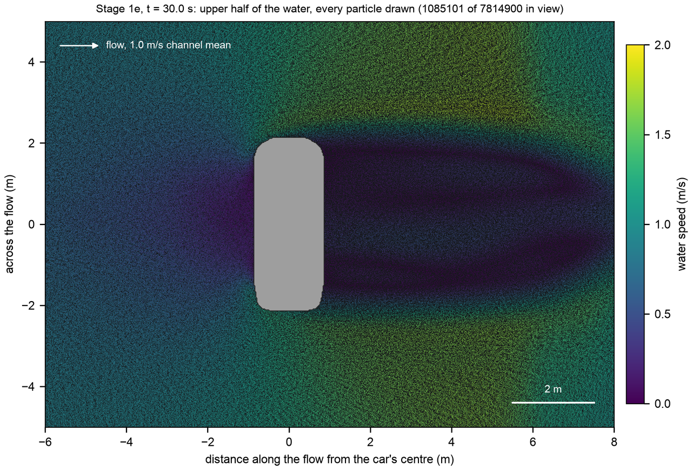
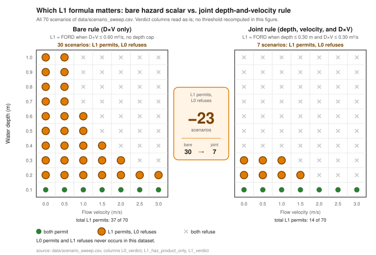
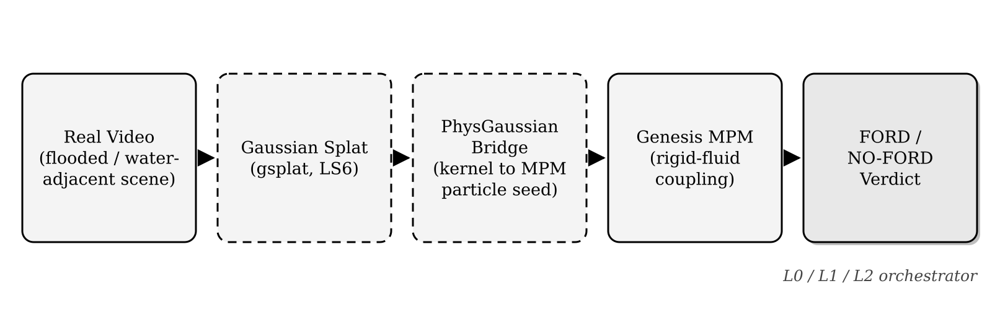

# Can It Ford?

**Can a specific vehicle cross a specific flooded road? Three models answer, from a one-line depth
rule to a coupled GPU water simulation, and the interesting result is where they disagree.**

<p align="center">
  
</p>
<p align="center"><em>WARPMPM simulation on TACC Lonestar6 (job 3484188): a Toyota Yaris hull held fixed,
broadside, in a 20 m wide periodic channel of water 0.30 m deep moving at a mean 1.0 m/s, 30 s after the
flow started. Each dot is a simulated water particle in the upper half of the water, coloured by speed.
The run did not pass the project's pre-registered steadiness test, so the image shows a flow pattern,
not a measured drag.</em></p>

> [!WARNING]
> This is a research project, not a safety tool. Its thresholds come from draft and interim
> criteria for stationary vehicles. Never drive into floodwater.

[](LICENSE)
[](https://huggingface.co/spaces/josiecerrell/can-it-ford)
[](https://can-it-ford.vercel.app)
[](https://github.com/jcerrell-IS/can-it-ford/actions/workflows/csv-check.yml)

*Josie Cerrell, Claremont McKenna College. NSF REU Site SCIPE-AI (Award #2447887), GeoElements
Lab, Texas Advanced Computing Center, The University of Texas at Austin. Mentor: Krishna Kumar.*

## Summary

In the US, flooded roads kill more people than any other flood hazard, and most of those deaths
involve someone driving into the water. A self-driving car has the same problem a driver does: it
has to decide whether the water is safe to drive through. This project asks that for one car, a
2010 Toyota Yaris, and checks how simple the method can be and still give the right answer. It
compares three methods on the same 70 combinations of water depth and speed: a water-depth rule
(L0), the Australian flood guideline for vehicles, AR&R (L1), and a GPU simulation of water
flowing around the car (L2).

The two rules disagree before any simulation is run. The depth rule allows 7 crossings and the
full AR&R guideline allows 14, and the type of vehicle alone changes the answer in 12 cases. Using
the full guideline, instead of the depth x speed shortcut it is often reduced to, changes 23 cases
from safe to unsafe and none the other way. The first simulations turned out to be measuring the
start of the flow instead of a steady current, so their results were withdrawn. A new set of
steady-current runs on TACC's Lonestar6 has produced flow patterns but no final answer yet.

**Paper:** [*Can It Ford? Query-Conditioned, Physically Viable World Models for Autonomous-Vehicle
Flood Traversability from Gaussian Splatting*](public_release/Cerrell_CanItFord_paper.pdf)
(September 2026 revision; the version submitted on July 31 is
[kept beside it](public_release/Cerrell_CanItFord_paper_as_submitted_2026-07-31.pdf)).
**Poster:** [TACC, July 2026](public_release/Cerrell_TACC_42x56.pdf).

## See it running

| | |
|---|---|
| **Live demo and simulation viewer** (start here) | [Can It Ford on Hugging Face Spaces](https://huggingface.co/spaces/josiecerrell/can-it-ford) |
| **Simulation records** | [TACC run records](https://huggingface.co/datasets/josiecerrell/can-it-ford-steady-force): configuration, status, wall time, GPU and per-frame time series for every steady-current run |
| **Plain-language explainer** | [can-it-ford.vercel.app](https://can-it-ford.vercel.app) |
| **Data** | [Scenario sweep](https://huggingface.co/datasets/josiecerrell/can-it-ford-scenario-sweep) and [load surface](https://huggingface.co/datasets/josiecerrell/can-it-ford-speed-surface) on Hugging Face |
| **Paper and poster** | [`public_release/`](public_release/). One correction to the July poster: it says all 17 runs are bit-reproducible, but the check behind that only confirms that each run's setup is repeatable; repeat runs are not bit-identical. |

## Key results

<p align="center">
  
</p>
<p align="center"><em>The same 70 scenarios under the bare depth x velocity rule (left) and the full
AR&R rule for a small passenger car (right). Restoring the depth cap and the car's own class cuts
the permitted crossings from 37 to 14. Both panels read stored verdicts from
<code>data/scenario_sweep.csv</code>; no simulation is involved.</em></p>

- **The depth x velocity shortcut is only part of the published rule.** The AR&R criterion needs
  a class depth cap, a 3.0 m/s velocity cap and a depth x velocity cap to hold together. Applying both, for the car's own class,
  moved 23 of 70 flood scenarios from FORD to NO-FORD, and none the other way
  ([`data/scenario_sweep.csv`](data/scenario_sweep.csv)).
- **The first 17 coupled runs measured their own start-up, not a current.** In 16 of 17 the car
  passed the 0.05 m decision threshold 0.067 to 0.167 s after all the water was set moving in one step
  inside a closed tank, and by 2 s the water upstream had stopped or reversed. Their FORD and NO-FORD
  outcomes are withdrawn as verdicts. A steady-current campaign on TACC Lonestar6 replaces them; it has
  produced flow fields and diagnostics but no verdict yet.
- **3D scene reconstruction.** A Gaussian splat of a real drainage crossing: 1,147,694 Gaussians,
  trained with gsplat for 30,000 iterations, PSNR 22.74. A decimated preview is in the live demo's
  Reconstruction tab. The splat has no metric scale yet, and the bridge from splat to simulation
  is not built.
- **Each of the 17 gated runs has a provenance record that says how each field was obtained.**
  Each run wrote its own physics settings: particle counts, grid size and spacing, substeps, sound
  speed and floor friction. The solver version and mesh hash were filled in after the runs, assigned
  from the solver version the repository pins and from the mesh that matches each run's recorded
  hull volume. The code commit was reconstructed from file dates, so it is an upper bound rather than
  proof of what ran. The GPU (NVIDIA GH200 on Vista) was logged once per batch, not per run, and wall
  time was not recorded. The per-run records stay in the private development repository; the
  manifest carries their fields and labels. See
  [`data/reproducibility_manifest.json`](data/reproducibility_manifest.json), built by
  [`analysis/reproducibility_manifest.py`](analysis/reproducibility_manifest.py).

What is established, what is open, and the numbers this project has retired:
[`FINDINGS.md`](FINDINGS.md).

## What I did

- Wrote the depth rule and the AR&R guideline as code in one place,
  [`vehicle_params.py`](vehicle_params.py), with [tests](tests/) that check all 70 published cases
  against it.
- Ran water-and-car simulations on TACC's supercomputers with the warpmpm solver: 17 runs on Vista
  and 46 steady-current runs on Lonestar6, with up to 18.5 million water particles per run.
- Added features for loading car models to the solver, and fixed a bug in it:
  [jcerrell-IS/mpm-engine](https://github.com/jcerrell-IS/mpm-engine).
- Made a 3D model of a real flooded drainage crossing from video with gsplat, and started code to
  turn it into simulation particles ([`bridge/`](bridge/)).
- Recorded, for every run, which settings were saved by the run itself and which were filled in
  later, and kept a list of every number this project has taken back ([`FINDINGS.md`](FINDINGS.md)).

---

## What this does

Given a flooded road scene and a flood condition, this pipeline answers one question: **can a
specific vehicle ford this crossing?**

Three methods run side by side, from cheapest to most expensive, to find the simplest model that
still gets the answer right.

| Level | Model | Source |
|---|---|---|
| **L0** | Static depth threshold (d > 0.15 m gives NO-FORD, matching `scripts/gen_scenario_sweep.py`), a project choice. For comparison, NWS says about 0.15 m (6 in) of fast-moving water can knock over an adult and about 0.30 m (12 in) can carry away most cars | [NWS Turn Around Don't Drown](https://www.weather.gov/safety/flood-turn-around-dont-drown) |
| **L1** | AR&R three-part criterion: a class depth cap, a 3.0 m/s velocity cap and a D x V cap, all required together. The paper's canonical class is Small Car (depth <= 0.30 m and D x V <= 0.30 m2/s). The bare D x V <= 0.60 m2/s figure often quoted is the Large 4WD hazard cap alone, with no depth restriction. Draft/interim criterion from the source report, not an endorsed safety standard. | Shand et al. 2011, AR&R Project 10 Stage 2 (Engineers Australia) |
| **L2** | Coupled particle simulation: weakly compressible water plus a rigid vehicle body. The first runs imposed the flow as a one-step surge in a closed tank, so their drift labels describe that surge; a steady-current version runs on TACC Lonestar6 and has no verdict yet | This project |

The intended front end reconstructs the scene from video using 3D Gaussian splatting. One real
scene has been reconstructed and trained as a splat, but it has no metric scale yet and the
splat-to-simulation bridge is not built, so every reported result starts from a watertight vehicle
mesh and a parameterized flood condition, not from a splat.

The abstraction ladder is a running instance of the Section 3 orchestrator in
[Physically Viable World Models (Thorpe et al. 2026, arXiv:2605.30542)](https://arxiv.org/abs/2605.30542).
The forward direction here (known scene plus known flood gives a verdict) is the sibling of the
inverse direction in [Hsiao and Kumar 2025 (arXiv:2507.09005)](https://arxiv.org/abs/2507.09005),
which recovers material properties from images.

## Pipeline



```
video  ->  gsplat (LS6 A100)  ->  splat to MPM particles  ->  MPM water + rigid vehicle (Vista GH200)  ->  FORD / NO-FORD
[ ran on one scene, unscaled ]    [ designed, not built ]     [ built; steady-current runs in progress, no verdict yet ]
```

The splat-to-particle bridge is intended to reuse
[PhysGaussian (Xie et al. 2023, arXiv:2311.12198)](https://arxiv.org/abs/2311.12198) extraction
logic on top of [3D Gaussian Splatting (Kerbl et al. 2023, arXiv:2308.04079)](https://arxiv.org/abs/2308.04079).
`bridge/` holds a partial scaffold of an independent implementation of that published algorithm,
targeting Genesis `MPM.Liquid`. It is not runnable end to end.

## Paper figures

Each figure in the paper and the code and data in this repository that draw it.

| Figure | Shows | Script | Data |
|---|---|---|---|
| 1 | Reconstruct-to-decide pipeline | [`analysis/paper_fig_pipeline_diagram_v2.py`](analysis/paper_fig_pipeline_diagram_v2.py) | none |
| 2 | L0 versus L1 under the bare and joint rules | [`analysis/paper_fig_l0l1_two_rules_v2.py`](analysis/paper_fig_l0l1_two_rules_v2.py) (same data and counts; the paper's version adds reclassification markers) | [`data/scenario_sweep.csv`](data/scenario_sweep.csv) |
| 3 | L1 for AR&R's three vehicle classes | [`analysis/plot_l1_three_class.py`](analysis/plot_l1_three_class.py) | [`data/scenario_sweep.csv`](data/scenario_sweep.csv) |
| 4 | Drag against friction, and critical velocity | analytic; every input is stated in the caption | none |
| 5 | L1 against the Genesis SPH pilot, 9 conditions | [`analysis/paper_fig_l2_divergence_v2.py`](analysis/paper_fig_l2_divergence_v2.py) | [`data/l2_results_from_wandb.csv`](data/l2_results_from_wandb.csv) |
| 6 | Coupled displacement against mass at three grids | [`analysis/paper_fig_mass_grid_sweep_v2.py`](analysis/paper_fig_mass_grid_sweep_v2.py) | [`data/all_runs_inventory.csv`](data/all_runs_inventory.csv) |
| 7 | One frame of run `g64_m1100` | [`analysis/render_v1/render_realistic.py`](analysis/render_v1/render_realistic.py) | the run's particle rollout, not included |

Figures 1, 2, 3, 5 and 6 regenerate from a fresh clone with `pip install -r requirements.txt`.

---

## Reproduce

### Setup and tests (any machine, no GPU)

```bash
pip install -r requirements.txt pytest
pytest -q tests
```

### L0 and L1

```bash
python3 simulation/can_it_ford_L0.py <depth_m>
python3 simulation/can_it_ford_L1.py <depth_m> <velocity_ms> [vehicle_class]
```

Vehicle class options: `small_passenger` (default, the Yaris), `large_passenger`, `large_4wd`. The script
applies all three AR&R conditions through `vehicle_params.L1_verdict`.

### L2, the coupled simulation (GPU)

The 17 coupled runs were launched with the driver snapshot
[`analysis/render_v1/as_ran_local_copies/sim_standing.py`](analysis/render_v1/as_ran_local_copies/sim_standing.py)
(sha256 `5215c38b`, the hash the July batch logs recorded) and the `warpmpm` solver (NVIDIA Warp),
on TACC's Vista (NVIDIA GH200). [`renders/yaris_render_s1/sim_standing.py`](renders/yaris_render_s1/sim_standing.py)
is a later revision of the same driver (sha256 `4696c3b2`); use the snapshot to reproduce the
published runs.

1. Install `warpmpm` from [jcerrell-IS/mpm-engine](https://github.com/jcerrell-IS/mpm-engine), a
   fork of [kks32/mpm-engine](https://github.com/kks32/mpm-engine) that adds the watertight-mesh
   particle seeding these runs use: `pip install -r requirements-gpu.txt` (Linux, NVIDIA GPU,
   Python 3.12). The runs recorded solver commit `544c93dd` but used the seeding change as an
   uncommitted local patch, later committed as `b43c3a2`; the pinned fork commit contains both, so
   it reconstructs the solver that ran rather than recording it.
2. The vehicle hull and the upstream model are in
   [`vehicle_geometry_research/`](vehicle_geometry_research/), with provenance and the CCSA
   acknowledgement in that folder's README.
3. Run one case. For example, run `g64_m1100`, one of the 17 (its row is in
   [`data/all_runs_inventory.csv`](data/all_runs_inventory.csv)):

```bash
python analysis/render_v1/as_ran_local_copies/sim_standing.py \
    --vehicle vehicle_geometry_research/yaris_coarse_v1l_watertight.ply \
    --mass 1100 --grid 64 --depth 0.30 --velocity 1.5 --frames 90 \
    --eta 1.0e-3 --floor-friction 0.55 --label small_passenger --out runs/g64_m1100
```

The run writes `metrics.csv`, `rollout.npz` and `summary.json` into `--out`. Both driver copies are
kept byte for byte as they ran, so their sha256 hashes still match the batch logs; that is why
their default paths point at TACC directories, and why the example passes `--vehicle` explicitly. Each row of
[`data/all_runs_inventory.csv`](data/all_runs_inventory.csv) gives one run's mass, grid, requested
depth and velocity.

Two older scripts are kept for the record and do not reproduce the reported results:
`simulation/can_it_ford_L2.py` is the superseded Genesis path, and
`simulation/can_it_ford_L2_mpm.py` still hardcodes a superseded vehicle box (4.66 x 1.79 x 1.44 m,
3.39x the real hull volume).

### Figures and renders

```bash
python3 analysis/make_phase_space_v2.py
python3 scripts/render_frames.py --input particles.npz --output water_box.mp4 \
    --box-center 1.0 0.0 0.35 --box-size 1.0 1.6 1.5 --fps 24
```

`make_phase_space_v2.py` checks the stored L1 verdicts against the rule and redraws the L1
phase-space figure into `figures/`, with the Genesis pilot overlaid for the record.
`scripts/render_frames.py` renders MPM particle output to MP4 without a display. Run it with no `--input`
for a synthetic demo that checks the renderer works. Particle files are not included in this
repository.

### Consistency checks

No gate in this project is a physics validation. Each gate is a self-consistency or
numerical-containment check. `analysis/viability_audit.py` reads final-state `.npz` particle files
and reports total water momentum per run. It does **not** verify mass conservation: the former
mass-integrity check was withdrawn on July 15, 2026 as tautological (it compared a value to itself
and could not fail). Per-step invariant checking is not yet implemented.

---

## Data

| File | Description |
|---|---|
| `data/all_runs_inventory.csv` | **Primary source for the coupled sweep.** 17 runs on the watertight Yaris hull. 7 of the 17 exceed a 10 percent particle-passthrough gate and are flagged, not excluded. |
| `data/reproducibility_manifest.json` | Provenance record for the 17 runs: code commit, solver version, mesh hash, grid and material settings per run, how each field was obtained (recorded by the run, or filled in afterwards), plus what is absent and why. |
| `data/scenario_sweep.csv` | L0/L1 grid (depths 0.1 to 1.0 m x velocities 0.0 to 3.0 m/s), 70 scenarios, with the full and product-only L1 encodings side by side. FORD counts out of 70 for the three classes: 14, 19, 26. |
| `data/mu_sweep_results.csv` | Vehicle-water coupling-friction sensitivity at (d=0.30 m, v=1.5 m/s), from the Genesis pilot. Not floor (road) friction |
| `data/three_class_*_2026-08-14.csv` | Non-canonical `warpmpm` floor-friction and three-vehicle study at nominal depth 0.30 m and 1.5 m/s. Peak drift falls as floor friction rises in every group tested. Mostly single runs, and every friction-varied run on the finer grid exceeds the 10 percent passthrough gate |
| `data/l2_results_from_wandb.csv` | Genesis SPH pilot on a synthetic box vehicle (not the WARPMPM L2), pulled from W&B, which records runtime 0 for these runs. Its `l1_verdict` column applies the bare 0.6 m2/s product, which agrees with the pilot at 5 of 9 conditions; under the full AR&R rule the count depends on the vehicle class (6 of 9 for a small passenger car, with disagreements in both directions). The pilot's drift-only verdict also reads FORD in 0.6 m of still water. Do not quote any agreement rate from it |
| `data/phase_space_results.csv` | L2 SPH pilot output (pre-fix). **Not usable for an agreement rate:** it carries a single verdict column with no corresponding L1 value, and 15 of its 31 rows share a condition with another row under a different verdict |
| `data/track1_sweep_v2/` | **Superseded and excluded from the paper.** 36-run sweep on a rescaled box proxy (1390 kg, 4.7352 m3 against the real hull's 3.5427 m3). Kept as a record; do not cite its numbers |

## Limitations

- **Not a safety tool.** L1 uses draft and interim criteria that describe a stationary vehicle.
- **Flagged runs.** 7 of the 17 coupled runs exceed the 10 percent particle-passthrough gate. They
  are flagged, not excluded.
- **One hull.** The mass sweep (1,100, 1,609 and 2,337 kg) varies mass on a single Yaris hull, so
  it is a sensitivity study, not a comparison of vehicle classes.
- **Reconstruction is not connected yet.** One scene is trained as a splat, but it has no metric
  scale and no bridge to the simulation, so every reported result starts from a mesh, not a splat.
- **Not bit-reproducible.** Repeat runs of the same case differ: eight same-seed repeats of one
  non-canonical case span 0.087 to 0.092 m in peak drift, about 6 percent. The determinism flag in
  each run record only checks that the vehicle loads to the same particle count and domain size.

The full list, with the numbers this project has retired, is in [`FINDINGS.md`](FINDINGS.md).

<details>
<summary><b>Vehicle parameters</b></summary>

`vehicle_params.py` holds three primary-sourced passenger-vehicle classes:

| Class | Anchors | Mass | Bounding box (L x W x H, m) | Inertia source |
|---|---|---|---|---|
| `compact_sedan` | Toyota Yaris (2010, NCAC/CCSA FE model) | 1100 kg | 4.30 x 1.70 x 1.47 | uniform-box fallback, **not** a measured tensor; mass/bbox from the [CCSA FE model documentation](https://doi.org/10.13021/G8JS5D) |
| `midsize_suv` | Toyota Highlander, Ford Explorer | 1990 kg | 4.96 x 1.93 x 1.75 | measured, NHTSA SAE 1999-01-1336 |
| `light_pickup` | Ford F-150, Toyota Tacoma/Tundra | 2300 kg | 5.89 x 2.03 x 1.96 | measured, NHTSA SAE 1999-01-1336 |

The `compact_sedan` bounding box is the vehicle's published nominal specification, not the
watertight hull's measured extent. The mesh spans 4.2826 x 1.7464 x 1.5180 m (11.3533 m3 against
the nominal 10.7457 m3). Anything computing displaced volume should use the measured hull volume,
3.5427 m3.

That mismatch is diagnosed, not resolved. The mesh extent in `gates.py`
(`EXT_REF = [1.746, 4.283, 1.518]`) and the specification box in `vehicle_params.py`
(`bbox_m = (4.30, 1.70, 1.47)`) differ by more than 2 percent in height and width (height 3.16 or
3.27 percent, width 2.63 or 2.71 percent; length agrees to 0.40 percent). The consistency gate
written to catch this, `check_bbox_agreement()`, is switched off: the two values measure different
objects, so the tolerance is mis-specified rather than either value being wrong.

For `midsize_suv` and `light_pickup`, center-of-gravity heights and full inertia tensors come from
the NHTSA Light Vehicle Inertial Parameter Database, measured on instrumented rigs.
`compact_sedan` is the exception: the NHTSA database ends in November 1998 and holds no Yaris, so
its CG height and tensor are estimates. A measured 2010 Yaris tensor exists on slide 7 of
[DOI 10.13021/G8JS5D](https://doi.org/10.13021/G8JS5D) (1078 kg; roll 388, pitch 1498, yaw
1647 kg m^2; CG Z 558 mm) and is deliberately not wired in: see note 3 in `vehicle_params.py`.
Call `get_vehicle(vehicle_class)` for a simulation-ready dict.

</details>

---

## Repo structure

```
simulation/              L0, L1 and L2 scripts
analysis/render_v1/as_ran_local_copies/  The driver and job script exactly as the 17 coupled runs used them
renders/yaris_render_s1/ A later revision of that driver
realism_track/           Coupling-accuracy checks: buoyancy and force on submerged bodies against analytic values, with job records
analysis/                Figures, provenance manifest, consistency checks
tests/                   Rule, sweep and bridge tests, run by CI
vehicle_params.py        Cited vehicle classes (mass, bbox, CG, inertia)
data/                    Experiment CSVs and the provenance manifest
figures/                 Output figures, pipeline diagram, short run videos
bridge/                  Splat-to-particle bridge (independent reimplementation)
third_party/             Vendored warpmpm solver core (MIT)
hf_space/                Early version of the Hugging Face demo (the live Space holds the current app)
web/                     Source of the project site
public_release/          The paper and poster PDFs
citations/               Annotated bibliography, source documents and grounding notes
vehicle_geometry_research/  Vehicle finite element models and the derived hull
scripts/                 Utilities: data sync, manifests, Vista pull
paper/                   Paper figure sources and bibliography
docs/                    Design notes, and what the citations to internal notes refer to
archive/                 Superseded work kept for the record, such as the retracted product-only L1 rule
```

## Citations

Every threshold and parameter traces to a source. The annotated bibliography, with verification
status and caveats, is in [`citations/README.md`](citations/README.md). Load-bearing sources:

- **L1 hazard threshold:** Shand, Cox, Blacka & Smith (2011), AR&R Project 10 Stage 2, Engineers
  Australia report P10/S2/020.
- **L2 comparison data:** Smith, Modra & Felder (2019), full-scale tests of vehicle stability in
  flood waters, [DOI:10.1111/jfr3.12527](https://doi.org/10.1111/jfr3.12527).
- **Drift threshold reframing:** Xia et al. (2014) [DOI:10.1007/s11069-013-0889-2](https://doi.org/10.1007/s11069-013-0889-2); Shah et al. (2018) [DOI:10.1051/matecconf/201820307003](https://doi.org/10.1051/matecconf/201820307003).
- **Box-proxy vehicle comparison:** Xiong et al. (2024), Water Resources Research, [DOI:10.1029/2023WR036739](https://doi.org/10.1029/2023WR036739).
- **Vehicle inertia:** NHTSA / Heydinger et al., SAE 1999-01-1336, [DOI:10.4271/1999-01-1336](https://doi.org/10.4271/1999-01-1336).
- **Framework and technique:** [PVWM (arXiv:2605.30542)](https://arxiv.org/abs/2605.30542), [Hsiao and Kumar (arXiv:2507.09005)](https://arxiv.org/abs/2507.09005), [PhysGaussian (arXiv:2311.12198)](https://arxiv.org/abs/2311.12198), [3DGS (arXiv:2308.04079)](https://arxiv.org/abs/2308.04079).

See [`CITATION.cff`](CITATION.cff) for citing this repository.

## License

Code is released under the **[BSD 3-Clause License](LICENSE)**, the license
[recommended by DesignSafe-CI for research software](https://designsafe-ci.org/user-guide/curating/policies/).
The associated dataset is released under CC-BY-4.0 (see `CITATION.cff`). A dataset DOI is staged
at DesignSafe (PRJ-6388) and not yet published.

Third-party material in this repository keeps its own terms, listed per item in
[`THIRD_PARTY_NOTICES.md`](THIRD_PARTY_NOTICES.md).

## Acknowledgments

This work was supported by the National Science Foundation under NSF REU Site: Cyberinfrastructure
Research for Societal Advancement (SCIPE-AI), Award #2447887, hosted at the Texas Advanced Computing
Center, The University of Texas at Austin. Mentor: Krishna Kumar (GeoElements Lab). Research
mentors: Hassan Iqbal, Cheng-Hsi Hsiao, Sarah Etter. Near-peer mentor: Cristian Moran. Genesis
container: Luke Smith. Program coordination: Rosalia Gomez.

The vehicle geometry is derived from the 2010 Toyota Yaris finite element model developed by the
Center for Collision Safety and Analysis (CCSA) at George Mason University, with sponsorship from
the Federal Highway Administration (FHWA). This project acknowledges CCSA at GMU and FHWA for the
model.
